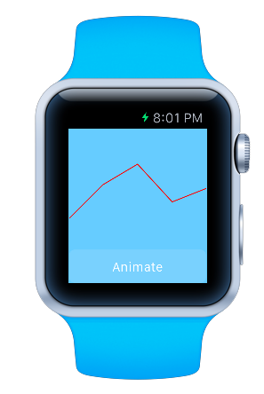

## Watch Animation Sample

Small sample to illustrate how image caching works using the WatchKit SDK for the Apple Watch. Sample generates a few points with a fixed horizontal spacing and random y. A series of frames are generated that animate over a one second period from a flat line near the top of the watch to their computed y value. The images are added to the watch's device cache and played back on at WKInterfaceImage. 

